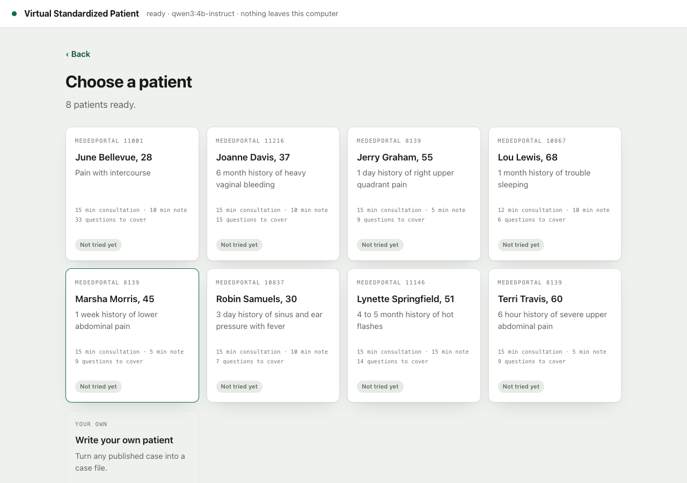
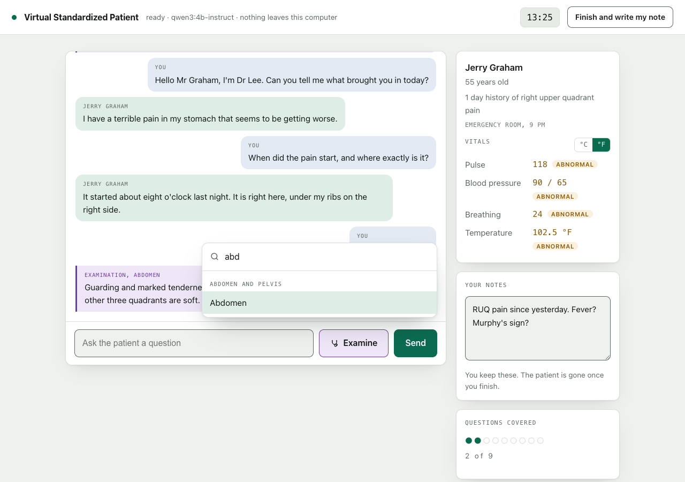
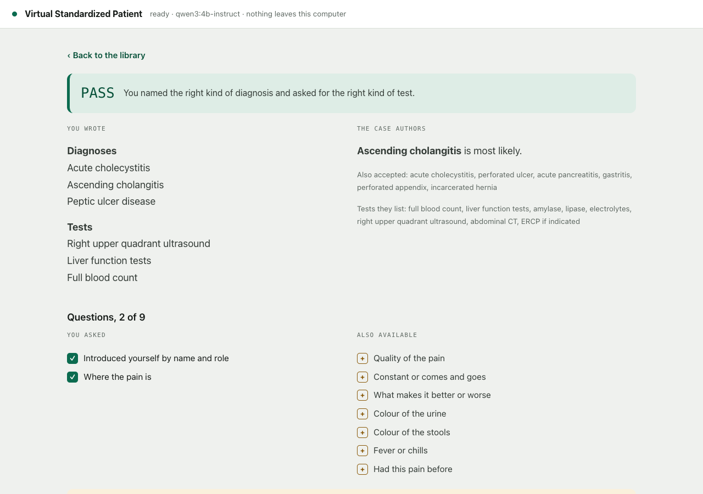
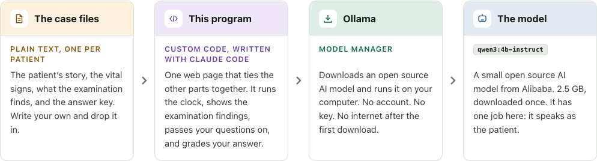
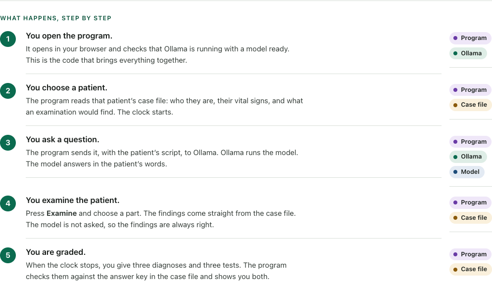

# Virtual Standardized Patient Simulator

A program for practising a clinical consultation with a simulated patient. The patient is
played by an AI model that runs on your own computer. It works without an internet connection.

- Free and open source, under the MIT licence.
- Built for the 5th Annual Global Health Conference, Southbury, Connecticut, September 2026,
  to show that an AI model can run on an ordinary laptop for teaching.

*Start the install below, or scroll down to read more about this project.*

## Install requirements

| Requirement | Minimum | Recommended |
|---|---|---|
| Memory (RAM) | 8 GB | 16 GB |
| Free disk space | 6 GB | 10 GB |
| Graphics chip | optional | any |
| Internet | for the first download only | |

A computer without a graphics chip works. Each reply takes a few seconds instead of one.

## Install instructions

Choose your system. Each page has every step, from the first download to the first patient.

| | |
|---|---|
| **[Install on a Mac](docs/install-mac.md)** | macOS |
| **[Install on Windows](docs/install-windows.md)** | Windows 10 or 11 |
| **[Install on Linux](docs/install-linux.md)** | Ubuntu, Fedora, and others |

The install takes about 15 minutes. Most of that time is a 2.5 GB download.

If a step does not work, see [If something goes wrong](docs/troubleshooting.md).

More about the program, its safety, and its licence is below.

---

## Before you start

> [!WARNING]
> - This is a demonstration of a teaching tool.
> - The patients are invented.
> - The model is small and can make mistakes while sounding certain.
> - There is no clinician behind the program, and nothing it produces has been checked.
> - Nothing here is medical advice. It is for education only.

## What it does

**1. Choose a patient.** You see their age, complaint, and vital signs.

**2. Interview and examine the patient.** You type questions. The patient answers. Press
**Examine** and choose a body part. The findings come from the case file.

**3. Write your note and see the result.** You write three diagnoses and three tests against
a second clock. The program marks them against the case authors' answer key.

Every encounter is saved on your computer. You can download it as one text file to send to
a tutor.

The eight patients are adapted from peer reviewed OSCE cases published in
[MedEdPORTAL](https://www.mededportal.org/), the open access journal of the Association of
American Medical Colleges.

## How it works

Four parts. All are open source.

| Part | Licence |
|---|---|
| The case files | CC BY |
| This program | MIT |
| Ollama | MIT |
| The model, `qwen3:4b-instruct` | Apache 2.0 |

What happens, step by step:

The model has one job: it speaks as the patient. The examination findings, the question count,
and the marking come from the case file.

## Is it safe?

Each claim below can be checked in the files in this folder.

- **Nothing leaves your computer.** The page sends requests to two places: Ollama, on your own
  computer at `127.0.0.1:11434`, and the `cases` folder. Search `index.html` for `fetch(` to
  see both. The other web addresses in the file are links. They load only if you click them.
- **No account, no sign-in, no cookies, no analytics.**
- **The launcher installs nothing.** It uses a program your system already has: Perl on a
  Mac, PowerShell on Windows, Python on Linux. When you close its window, it stops.
- **The launcher serves this folder to this computer only.** It listens on `127.0.0.1`. Other
  computers on your network cannot reach it. Requests for files outside the folder get a
  404 error. This was tested.
- **Every part is open source.** The program is one file. Anyone can read it.
- **The model comes from Ollama's own library**, the same source every Ollama user downloads from.
- **The code was reviewed and tested.** Five reviewers read the code with different briefs.
  A second reviewer tried to refute each finding. 59 findings were raised, 7 were confirmed,
  and all 7 were fixed and re-tested. The full session was run in a real browser against the
  real model. See [`docs/VERIFICATION.md`](docs/VERIFICATION.md).
- **Saved encounters** are stored by your browser, on your computer.

Not yet tested:

- The Windows launcher has never been run on Windows.
- The Linux launcher has never been run on Linux.
- Speed on a computer without a graphics chip has not been measured.

If you run one of these, please open an issue and say whether it worked.

## Terms of use

The same terms are shown inside the program.

**Licence and copyright.** Copyright 2026 Igor Gembitsky. This program is open source under
the MIT licence:

- You may use it, copy it, change it, and give it to other people.
- You may do this for free, for any purpose, including teaching and commercial work.
- Keep the copyright line, and do not hold the author responsible.

**The Creative Commons Attribution condition.** The cases are published under CC BY. That
licence lets you use, change, and pass on the cases, including commercially. It asks for
three things:

- Name the authors, with the title, the year, and a link to the original.
- Say what you changed.
- Name the licence.

This program does all three. The credit appears at the top of every case file, on the welcome
screen, on the case card, on the result screen, and in every downloaded report. If you pass
this on or change a case, keep that credit with it.

**Warning.** Nothing here is medical advice. It is for education only.

## Licence and credit

Copyright 2026 Igor Gembitsky. MIT licence. See [`LICENSE`](LICENSE).

The cases are used under the Creative Commons Attribution licence. See
[`cases/LICENSE.md`](cases/LICENSE.md). Each case file names its authors, its licence, and the
changes made. For example:

> Falcone J, Ogilvie J. *Three Adult Acute Abdominal Pain Objective Structured Clinical
> Examination (OSCE) Cases for Medical Student Assessment in the Surgery Clerkship.*
> MedEdPORTAL. 2011. doi:10.15766/mep_2374-8265.8139
> Copyright 2011 Falcone and Ogilvie. Case materials copyright University of Pittsburgh
> School of Medicine, 2010.

To cite this program:

> Gembitsky I. Virtual Standardized Patient Simulator. 2026.
> https://github.com/igembitsky/virtual-standardized-patient

## Who made it

**Igor Gembitsky**, invited speaker on artificial intelligence in medical education at the
[5th Annual Global Health Conference](https://www.theglobalhealthacademy.org/global-health-academy/global-health-conferences/2026-home),
Southbury, Connecticut, 27 September to 1 October 2026.

- Stuck? Open an issue, or write to me.
- Want to contribute a case, a translation, or an improvement? Send a pull request.
- Building on this for your school or programme? I am glad to talk it through.
- Want to commission work, or a talk? Ask.

[linkedin.com/in/gembitsky](https://www.linkedin.com/in/gembitsky)

## For developers

The program is one text file, `index.html`. Some ways to build on it:

- Run a larger model, or a hosted one.
- Change the patient's rules in the prompt.
- Write your own patients, in any language.
- Build other tools on the same parts: a tutor, an examiner, a flashcard maker.

How to do each, and a map of the files, is in [For developers](docs/for-developers.md).
