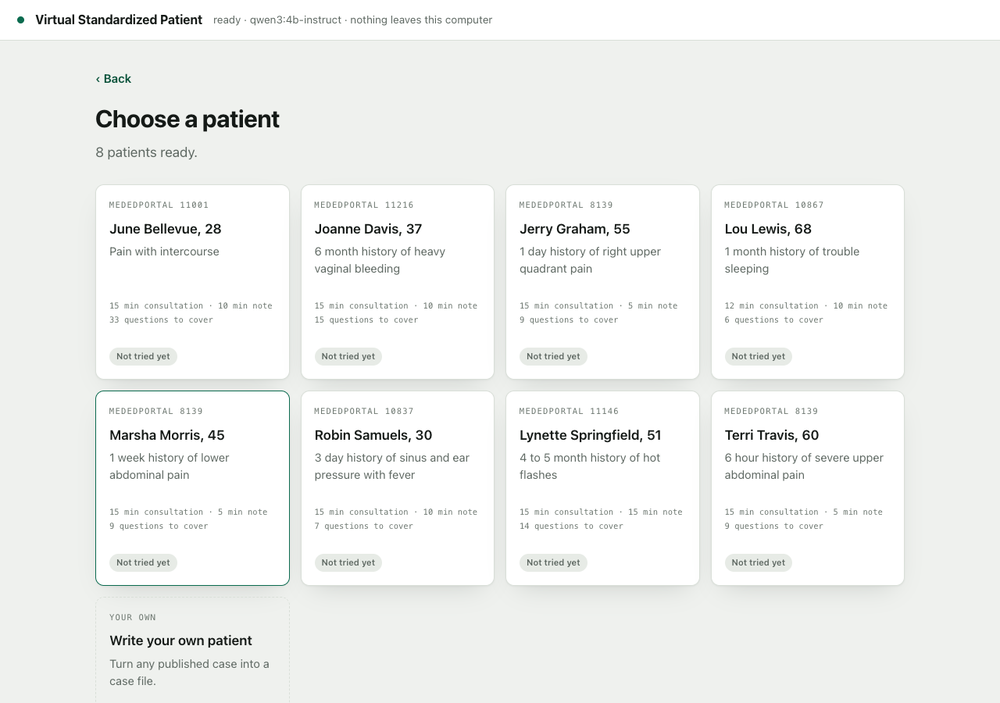
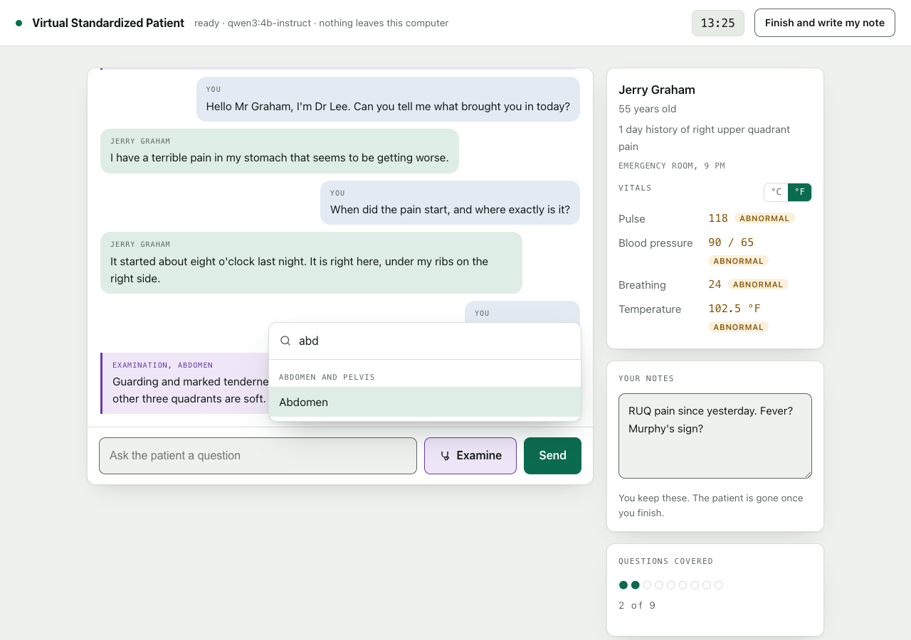
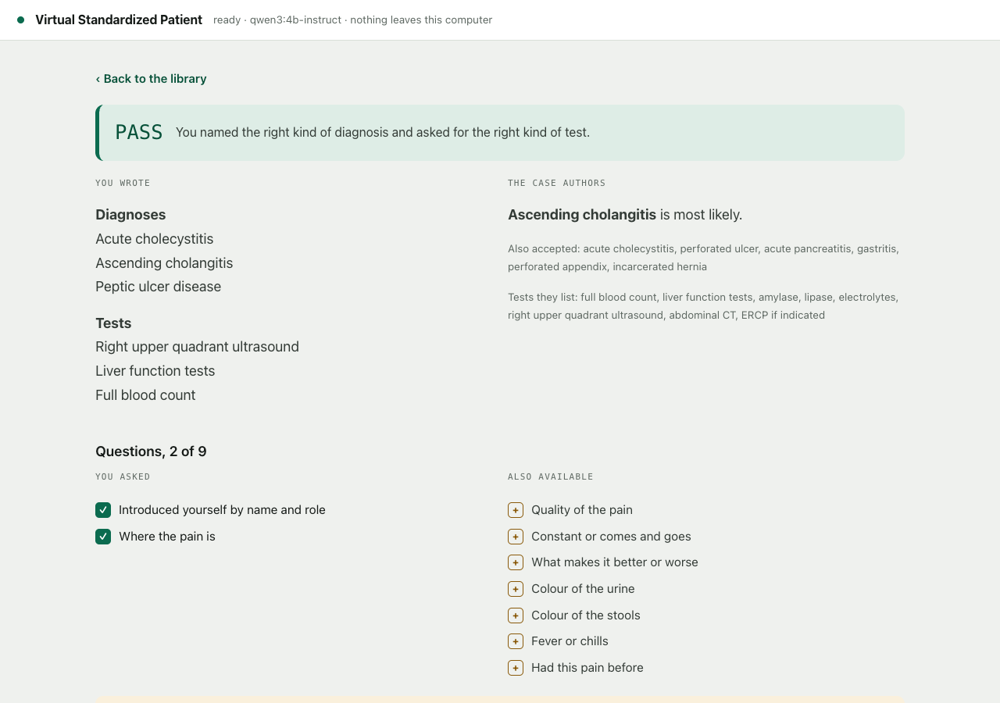
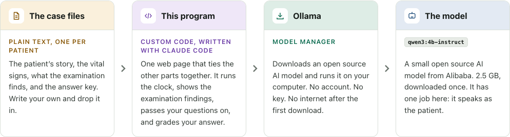
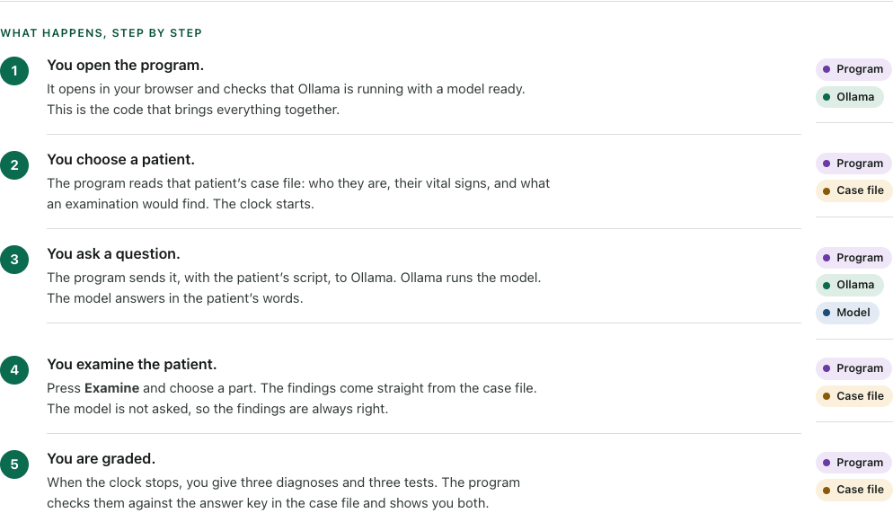

# Virtual Standardized Patient Simulator

A program for practising a clinical consultation with a simulated patient. The patient is
played by an AI model that runs on your own computer. It works without an internet connection.

- Free and open source, under the MIT licence.
- Built for the 5th Annual Global Health Conference, Southbury, Connecticut, September 2026,
  to show that an AI model can run on an ordinary laptop for teaching.

*Start the install below, or scroll down to read more about this project.*

## What you need

| | Mac | Windows | Linux |
|---|---|---|---|
| System | macOS 14 Sonoma or newer | Windows 10 (22H2) or 11 | 64-bit Ubuntu, Fedora, Debian, and others |
| Memory (RAM) | 8 GB | 8 GB | 8 GB |
| Free disk space | 4 GB | 7 GB | 7 GB |
| Download, once | 2.7 GB | 4.1 GB | 3.9 GB |

After the download, it works without the internet.

## Install instructions

Choose your system. Each page has every step, from the first download to the first patient.

| | |
|---|---|
| **[Install on a Mac](docs/install-mac.md)** | macOS 14 Sonoma or newer |
| **[Install on Windows](docs/install-windows.md)** | Windows 10 (22H2) or 11 |
| **[Install on Linux](docs/install-linux.md)** | Ubuntu, Fedora, and others |

The install takes about 15 minutes. Most of that time is a 2.5 GB download.

After that, you double-click **Start on Mac**, **Start on Windows**, or **Start on Linux**.
The simulator opens in your browser. No other window opens. Close the tab, or press **Quit**,
and it stops and gives the memory back.

What changed in each version is in [`CHANGELOG.md`](CHANGELOG.md).

If a step does not work, see [If something goes wrong](docs/troubleshooting.md).

More about the program, its safety, and its licence is below.

---

## Before you start

> [!WARNING]
> - This is a demonstration of a teaching tool.
> - The patients are invented.
> - The model is small and can make mistakes while sounding certain.
> - There is no clinician behind the program, and nothing it produces has been checked.
> - Nothing here is medical advice. It is for education only.

## What it does

**1. Choose a patient.** You see their age, complaint, and vital signs.

**2. Interview and examine the patient.** You type questions. The patient answers. Press
**Examine** and choose a body part. The findings come from the case file.

**3. Write your note and see the result.** You write three diagnoses and three tests against
a second clock. The program marks them against the case authors' answer key.

Every encounter is saved on your computer. You can download it as one text file to send to
a tutor.

The eight patients are adapted from peer reviewed OSCE cases published in
[MedEdPORTAL](https://www.mededportal.org/), the open access journal of the Association of
American Medical Colleges.

## How it works

Four parts. All are open source.

| Part | Licence |
|---|---|
| The case files | CC BY |
| This program | MIT |
| Ollama | MIT |
| The model, `qwen3:4b-instruct` | Apache 2.0 |

What happens, step by step:

The model has one job: it speaks as the patient. The examination findings, the question count,
and the marking come from the case file.

An automated test checks that the patient keeps to its case. The results are on
[the benchmark page](https://igembitsky.github.io/virtual-standardized-patient/benchmark.html).

## Is it safe?

**Automated security checks run on every change. [View the results](https://github.com/igembitsky/virtual-standardized-patient/actions).**

- **Launcher tests** run each launcher on a real Mac, Windows and Linux machine, from the
  same ZIP you download. They include the attacks that an independent audit tried: other web
  sites, files outside the folder, and more.
- **CodeQL** is GitHub's scanner for security defects in the page and the Python code.
- **OpenSSF Scorecard** checks the project's security practices.
  [See the score](https://scorecard.dev/viewer/?uri=github.com/igembitsky/virtual-standardized-patient).
- To report a security problem privately, see [SECURITY.md](SECURITY.md).

These checks find known kinds of problems. They cannot prove that a program has none.

Each claim below can be checked in the files in this folder.

- **Nothing leaves your computer.** Your questions go only to Ollama, on your own computer at
  `127.0.0.1:11434`. Saved encounters stay in your browser. The page asks GitHub for one small
  file, `VERSION`, to see whether a new version exists. Nothing is sent with it. Search
  `app/index.html` for `fetch(` to see every request.
- **No account, no sign-in, no cookies, no analytics.**
- **The launcher installs nothing.** It uses a program your system already has: Perl on a
  Mac, PowerShell on Windows, Python on Linux. It stops by itself a few seconds after you
  close the browser tab, and tells Ollama to unload the model.
- **The launcher serves this folder to this computer only.** It listens on `127.0.0.1`. Other
  computers on your network cannot reach it. Requests for files outside the folder get a
  404 error. Other web sites open in your browser cannot use it.
- **It never downloads or installs program files by itself.** When a new version exists, the
  page shows a link to it, and you download it yourself.
- **Every part is open source.** The program is one file. Anyone can read it. The model comes
  from Ollama's own library.

## Terms of use

The same terms are shown inside the program.

**Licence and copyright.** Copyright 2026 Igor Gembitsky. This program is open source under
the MIT licence:

- You may use it, copy it, change it, and give it to other people.
- You may do this for free, for any purpose, including teaching and commercial work.
- Keep the copyright line, and do not hold the author responsible.

**The Creative Commons Attribution condition.** The cases are published under CC BY. That
licence lets you use, change, and pass on the cases, including commercially. It asks for
three things:

- Name the authors, with the title, the year, and a link to the original.
- Say what you changed.
- Name the licence.

This program does all three. The credit appears at the top of every case file, on the welcome
screen, on the case card, on the result screen, and in every downloaded report. If you pass
this on or change a case, keep that credit with it.

**Warning.** Nothing here is medical advice. It is for education only.

## Licence and credit

Copyright 2026 Igor Gembitsky. MIT licence. See [`LICENSE`](LICENSE).

The cases are used under the Creative Commons Attribution licence. See
[`app/cases/LICENSE.md`](app/cases/LICENSE.md). Each case file names its authors, its licence, and the
changes made. For example:

> Falcone J, Ogilvie J. *Three Adult Acute Abdominal Pain Objective Structured Clinical
> Examination (OSCE) Cases for Medical Student Assessment in the Surgery Clerkship.*
> MedEdPORTAL. 2011. doi:10.15766/mep_2374-8265.8139
> Copyright 2011 Falcone and Ogilvie. Case materials copyright University of Pittsburgh
> School of Medicine, 2010.

To cite this program:

> Gembitsky I. Virtual Standardized Patient Simulator. 2026.
> https://github.com/igembitsky/virtual-standardized-patient

## Who made it

**Igor Gembitsky**, invited speaker on artificial intelligence in medical education at the
[5th Annual Global Health Conference](https://www.theglobalhealthacademy.org/global-health-academy/global-health-conferences/2026-home),
Southbury, Connecticut, 27 September to 1 October 2026.

- Stuck? Open an issue, or write to me.
- Want to contribute a case, a translation, or an improvement? Send a pull request.
- Building on this for your school or programme? I am glad to talk it through.
- Want to commission work, or a talk? Ask.

[linkedin.com/in/gembitsky](https://www.linkedin.com/in/gembitsky)

## For developers

The program is one text file, `app/index.html`. Some ways to build on it:

- Run a larger model, or a hosted one.
- Change the patient's rules in the prompt.
- Write your own patients, in any language.
- Build other tools on the same parts: a tutor, an examiner, a flashcard maker.

How to do each, and a map of the files, is in [For developers](docs/for-developers.md).
