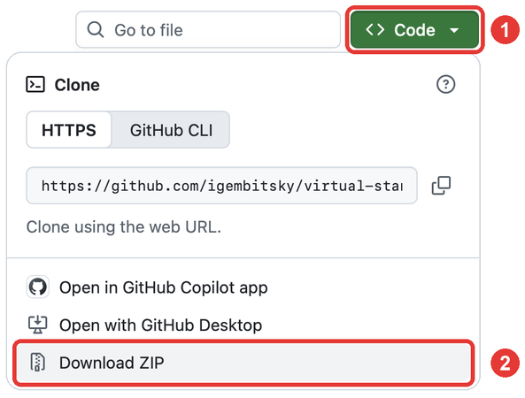

[← Back to the README](../README.md)

# Install on Linux

Time: about 15 minutes. Most of it is two downloads, 1.4 GB and 2.5 GB. You need a 64-bit
Linux, 8 GB of memory, 7 GB of free disk space, and Python 3, which nearly every Linux has.

> [!NOTE]
> The Linux launcher has not yet been run on a Linux desktop. If it works, or does not,
> please [open an issue](https://github.com/igembitsky/virtual-standardized-patient/issues) and say so.

## 1. Install Ollama

Ollama is the free program that runs the AI model on your computer.

1. Open a terminal.
2. Type this line and press Enter:

   ```
   curl -fsSL https://ollama.com/install.sh | sh
   ```

3. Enter your password if it asks.
4. Ollama now runs in the background, and starts with your computer.

## 2. Download the simulator

1. Go to [github.com/igembitsky/virtual-standardized-patient](https://github.com/igembitsky/virtual-standardized-patient).
2. Press the green **Code** button.
3. Press **Download ZIP**.

   

4. Open your **Downloads** folder. Right-click the ZIP file and choose **Extract Here**. A
   folder named `virtual-standardized-patient-main` appears.
5. Move that folder to your **Desktop**.

## 3. Start the simulator

**By double-click** (KDE, Cinnamon, Xfce, MATE, and GNOME with desktop icons)

1. Open the folder. Double-click `Start on Linux.desktop`.
2. If it asks whether to trust or launch it, choose **Trust and Launch**, **Allow Launching**,
   or **Execute**.

**From a terminal** (any Linux)

```
cd ~/Desktop/virtual-standardized-patient-main
python3 app/server.py
```

Then:

1. Your browser opens the simulator at `http://127.0.0.1:8756/`.
2. The first time, the page downloads the patient model and shows the progress. Keep the
   page open until it says **ready**.

## 4. Check it works

1. The dot at the top left of the page is green. The line beside it reads
   `ready · qwen3:4b-instruct · nothing leaves this computer`.
2. Press **Choose a patient**. Eight patients are listed.
3. Turn off Wi-Fi. Choose a patient and ask a question. The patient answers.

## Every time after this

1. Start it the same way as in step 3.
2. To stop, close the browser tab, or press **Quit** at the top of the page. The simulator
   stops within a few seconds and gives the memory back.

## New versions

The simulator never downloads or installs anything by itself. When a new version exists, the
top of the page shows **New version** and a link.

1. Press the link. GitHub opens the page of that version.
2. Under **Assets**, press **Source code (zip)**, and unzip it as in step 2.
3. Delete the old simulator folder, and put the new one in its place.

Your saved encounters stay, because your browser keeps them. The version you have is at the
bottom of the page.

## If something goes wrong

| What you see | What to do |
|---|---|
| **Something went wrong** | Press **Email report** to send the error report from your mail app, or **Report on GitHub** if you have a GitHub account |
| Double-click opens the file in a text editor | Start it from a terminal, as in step 3 |
| "Python 3 was not found" | Install Python 3 from your package manager. On Ubuntu: `sudo apt install python3` |
| **Ollama is not running** on the page | Do step 1 again |
| The download stopped | The page tries again by itself and carries on from where it stopped |
| The download does not start | In a terminal, run `ollama pull qwen3:4b-instruct`. Wait for `success` |
| The browser does not open | Open your browser and go to `http://127.0.0.1:8756/` |
| Nothing happens at all | Email the file `log.txt` from the simulator folder. If it is not there, email `/tmp/virtual-standardized-patient.log` |

In the page, **Report a problem** at the bottom sends an error report at any time.

Other problems are listed on [If something goes wrong](troubleshooting.md).

[← Back to the README](../README.md)
