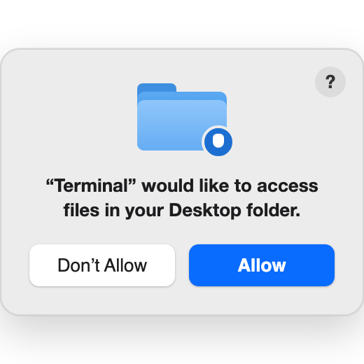

[← Back to the README](../README.md)

# Install on a Mac

Time: about 15 minutes. Most of it is a 2.5 GB download.

## 1. Install Ollama

Ollama is the free program that runs the AI model on your computer.

1. Go to [ollama.com/download](https://ollama.com/download).
2. Press **Download for macOS**.
3. Open the downloaded file and follow the steps on screen.
4. Open Ollama once. A llama icon appears in the menu bar at the top of the screen.
5. Leave it running.

## 2. Download the simulator

1. Go to [github.com/igembitsky/virtual-standardized-patient](https://github.com/igembitsky/virtual-standardized-patient).
2. Press the green **Code** button.
3. Press **Download ZIP**.
4. Open your **Downloads** folder and double-click the ZIP file.
5. Drag the new folder to your **Desktop**.

## 3. Start the simulator

1. Open the folder on your Desktop.
2. Double-click `start-mac.command`.
   If macOS says it could not verify the file, follow [If macOS blocks the file](#if-macos-blocks-the-file).
3. A Terminal window opens. Leave it open.
4. If Terminal asks to access files in your Desktop folder, press **Allow**.
   Pressed **Don't Allow**? See [If you pressed Don't Allow by mistake](#if-you-pressed-dont-allow-by-mistake).
5. The first time, the window downloads the patient model. Wait for **Download complete**.
6. Your browser opens the simulator.

## 4. Check it works

1. The dot at the top left of the page is green.
2. Press **Choose a patient**. Eight patients are listed.
3. Choose a patient and ask a question. The patient answers.

You can now turn off Wi-Fi and use the simulator offline. Nothing leaves this computer.

## Every time after this

1. Open the folder. Double-click `start-mac.command`.
2. To stop, close the Terminal window.

---

## Troubleshooting

You only need this part if a step above did not work.

### If macOS blocks the file

The message says Apple could not verify the file. This happens once.

**macOS 15 or newer**

1. Press **Done**.
2. Open **System Settings**.
3. Press **Privacy & Security**.
4. Scroll down to the **Security** section. Press **Open Anyway**.
5. Press **Open**.

**macOS 14 or older**

1. Right-click `start-mac.command`. On a trackpad, click with two fingers.
2. Choose **Open**.
3. Press **Open** again.

### If you pressed Don't Allow by mistake

Terminal needs to read the simulator files on your Desktop. The pop-up looks like this:

To give the permission again:

1. Open **System Settings**.
2. Press **Privacy & Security**.
3. Press **Files and Folders**.
4. Under **Terminal**, turn on **Desktop Folder**.
5. Double-click `start-mac.command` again.

### If the download stops or does not start

1. Close the Terminal window.
2. Double-click `start-mac.command` again. The download continues from where it stopped.

If the download still does not start, open Terminal and type `ollama pull qwen3:4b-instruct`. Press Enter. Wait for `success`.

### If the browser does not open

Open your browser and go to `http://127.0.0.1:8756/`.

### Other messages

| What you see | What to do |
|---|---|
| "Ollama is not installed" | Do step 1 again. Open Ollama once. Double-click `start-mac.command` again. |
| "You do not have appropriate access privileges" | Open Terminal. Type `chmod +x ` with a space after it. Drag `start-mac.command` into the window. Press Enter. Double-click the file again. |

### Add a shortcut

Right-click `start-mac.command`, choose **Make Alias**, and drag the alias to the Desktop.

Other problems are listed on [If something goes wrong](troubleshooting.md).

[← Back to the README](../README.md)
