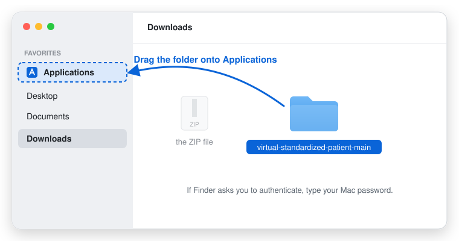
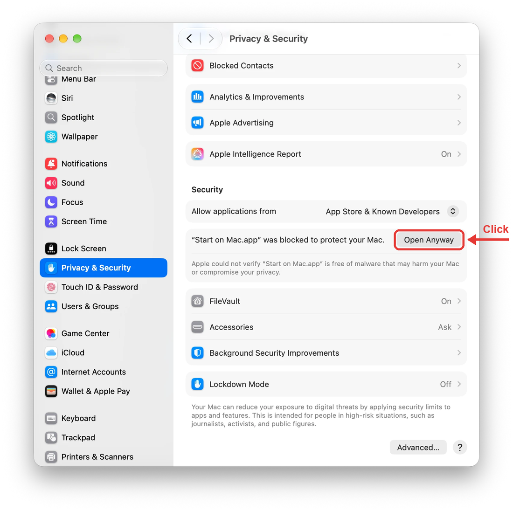
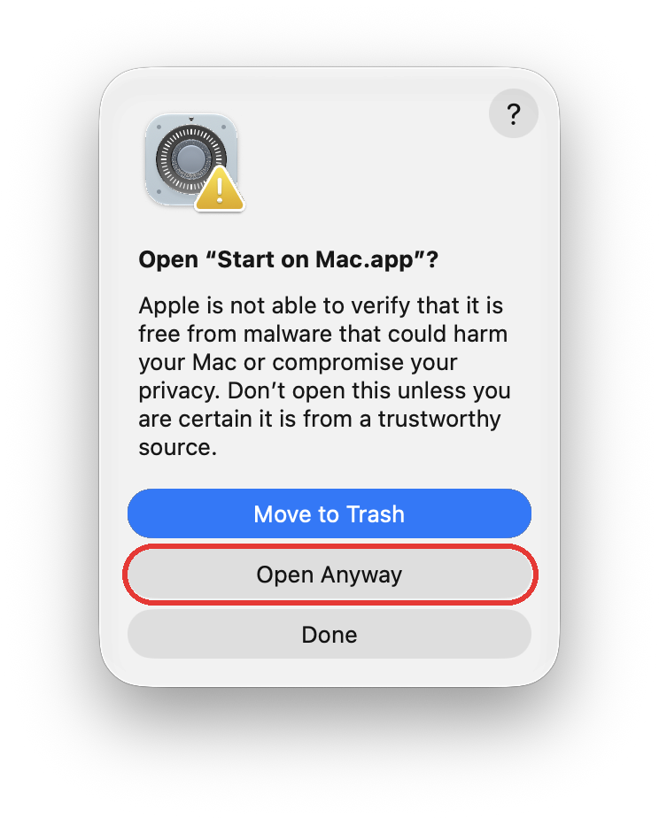

[← Back to the README](../README.md)

# Install on a Mac

Time: about 15 minutes. Most of it is a 2.5 GB download. You need macOS 14 Sonoma or newer,
8 GB of memory, and 4 GB of free disk space.

## 1. Install Ollama

Ollama is the free program that runs the AI model on your computer.

1. Go to [ollama.com/download](https://ollama.com/download).
2. Press **Download for macOS**.
3. Open the downloaded file and follow the steps on screen.
4. Open Ollama once. A llama icon appears in the menu bar at the top of the screen.

## 2. Download the simulator

1. Go to [github.com/igembitsky/virtual-standardized-patient](https://github.com/igembitsky/virtual-standardized-patient).
2. Press the green **Code** button.
3. Press **Download ZIP**.
4. Open your **Downloads** folder and double-click the ZIP file. If Safari already unzipped
   it, you see a folder named `virtual-standardized-patient-main` instead.
5. Drag that folder onto **Applications** in the Finder sidebar. If Finder asks you to
   authenticate, type your Mac password.

   

## 3. Start the simulator

1. Open **Applications**, then the folder `virtual-standardized-patient-main`.
2. Double-click **Start on Mac**. macOS says it could not verify the app. Press **Done**.
   This happens once, because the app does not come from the App Store.
3. Open **System Settings**, then **Privacy & Security**. Scroll down to **Security**. Next to
   "Start on Mac.app" was blocked, press **Open Anyway**.

   

4. macOS asks again. Press **Open Anyway**, then type your Mac password or use Touch ID.

   

5. Your browser opens the simulator.
6. The first time, the page downloads the patient model and shows the progress. Keep the
   page open until it says **ready**.

## 4. Check it works

1. The dot at the top left of the page is green.
2. Press **Choose a patient**. Eight patients are listed.
3. Choose a patient and ask a question. The patient answers.

You can now turn off Wi-Fi and use the simulator offline.

## Every time after this

1. Open **Applications**, then the folder. Double-click **Start on Mac**. To make this faster,
   drag **Start on Mac** to the Dock.
2. To stop, close the browser tab, or press **Quit** at the top of the page. The simulator
   stops within a few seconds and gives the memory back.

## Updates

When a new version exists, the top of the page shows **New version** and an **Update** button.
Press **Update**. The page reloads by itself after about 10 seconds. Your notes and your
history stay. The version you have is at the bottom of the page.

---

## Troubleshooting

You only need this part if a step above did not work.

### A faster way on macOS 14 Sonoma

The steps above work on every version. On macOS 14 there is also a faster way:

1. Right-click **Start on Mac**. On a trackpad, click with two fingers.
2. Choose **Open**.
3. Press **Open** again.

### If it asks you to move the folder into Applications

The folder is still on the Desktop, or in Documents or Downloads. A Finder window opens with
the folder selected.

1. Drag the folder onto **Applications** in the sidebar on the left.
2. Open **Applications**, then the folder, and double-click **Start on Mac** again.

### If something goes wrong

When the simulator cannot start, it says **Something went wrong** and offers two buttons.
**Email report** opens your mail app with an error report filled in. **Report on GitHub**
does the same on GitHub, which needs a free account. In the page, **Report a problem** at the
bottom does the same at any time.

If nothing happens at all:

1. Wait 20 seconds. The first start after a download can be slow.
2. Open your browser and go to `http://127.0.0.1:8756/`.
3. If that does not load, send the log with your report. It is the file `log.txt` in the
   simulator folder, next to **Start on Mac**. If it is not there, it is
   `virtual-standardized-patient.log` in your Logs folder: in Finder, choose **Go**, then
   **Go to Folder**, type `~/Library/Logs` and press Enter.

### If the download stops

The page tries again by itself and carries on from where it stopped. If it still does not
start, open Terminal and type `ollama pull qwen3:4b-instruct`. Press Enter. Wait for `success`.

### Add a shortcut

Drag **Start on Mac** to the Dock. Or right-click it, choose **Make Alias**, and drag the
alias to the Desktop. Keep the folder itself in Applications.

Other problems are listed on [If something goes wrong](troubleshooting.md).

[← Back to the README](../README.md)
