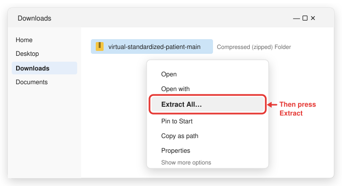
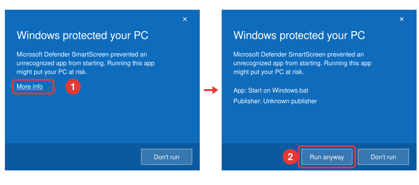

[← Back to the README](../README.md)

# Install on Windows

Time: about 20 minutes. Most of it is two downloads, 1.6 GB and 2.5 GB. You need Windows 10
(22H2) or 11, 8 GB of memory, and 7 GB of free disk space.

> [!NOTE]
> The Windows launcher has not yet been run on Windows. It uses only what Windows ships.
> If it works, or does not, please [open an issue](https://github.com/igembitsky/virtual-standardized-patient/issues) and say so.

## 1. Install Ollama

Ollama is the free program that runs the AI model on your computer.

1. Go to [ollama.com/download](https://ollama.com/download).
2. Press **Download for Windows**.
3. Open the downloaded file. Follow the steps on screen.
4. Open Ollama once. A llama icon appears near the clock, at the bottom right of the screen.

## 2. Download the simulator

1. Go to [github.com/igembitsky/virtual-standardized-patient](https://github.com/igembitsky/virtual-standardized-patient).
2. Press the green **Code** button.
3. Press **Download ZIP**.

   

4. Open your **Downloads** folder. Right-click the ZIP file and choose **Extract All**. Press
   **Extract**. A folder named `virtual-standardized-patient-main` appears.

   

5. Drag that folder to your **Desktop**.

## 3. Start the simulator

1. Open the folder on your Desktop. If it holds only another folder with the same name, open
   that one.
2. Double-click **Start on Windows**.
3. The first time, Windows may say **Windows protected your PC**. Press **More info**, then
   press **Run anyway**. This happens once.

   

   If the box says **Open File - Security Warning** instead, press **Run**.
4. A window flashes for a moment and closes. That is normal.
5. Your browser opens the simulator at `http://127.0.0.1:8756/`.
6. The first time, the page downloads the patient model and shows the progress. Keep the
   page open until it says **ready**.

## 4. Check it works

1. The dot at the top left of the page is green. The line beside it reads
   `ready · qwen3:4b-instruct · nothing leaves this computer`.
2. Press **Choose a patient**. Eight patients are listed.
3. Turn off Wi-Fi. Choose a patient and ask a question. The patient answers.

## Every time after this

1. Open the folder. Double-click **Start on Windows**.
2. To stop, close the browser tab, or press **Quit** at the top of the page. The simulator
   stops within a few seconds and gives the memory back.

## New versions

The simulator never downloads or installs anything by itself. When a new version exists, the
top of the page shows **New version** and a link.

1. Press the link. GitHub opens the page of that version.
2. Under **Assets**, press **Source code (zip)**, and unzip it as in step 2.
3. Delete the old simulator folder, and put the new one in its place.

Your saved encounters stay, because your browser keeps them. The version you have is at the
bottom of the page.

To add a shortcut: right-click **Start on Windows**, choose **Show more options**, then
**Send to**, then **Desktop (create shortcut)**.

## If something goes wrong

| What you see | What to do |
|---|---|
| A blue **Windows protected your PC** box | Press **More info**. Press **Run anyway** |
| **Something went wrong** | Press **Email report** to send the error report from your mail app, or **Report on GitHub** if you have a GitHub account |
| Nothing happens after 20 seconds | Open your browser and go to `http://127.0.0.1:8756/`. If that does not load, email the file `log.txt` from the simulator folder. If it is not there, press the Start button, type `%TEMP%`, press Enter, and email the file `virtual-standardized-patient.log` |
| **Ollama is not running** on the page | Open Ollama from the Start menu. The page notices by itself |
| The download stopped | The page tries again by itself and carries on from where it stopped |
| The download does not start | Press the Start button, type `PowerShell`, and open it. Type `ollama pull qwen3:4b-instruct`. Press Enter. Wait for `success` |

In the page, **Report a problem** at the bottom sends an error report at any time.

Other problems are listed on [If something goes wrong](troubleshooting.md).

[← Back to the README](../README.md)
